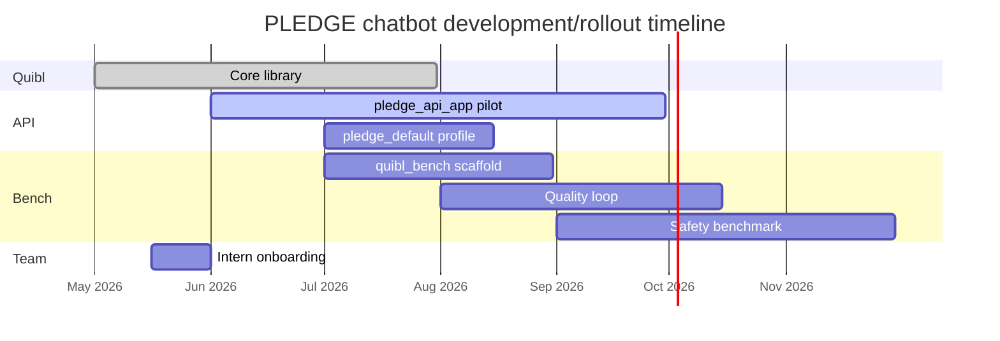

---
tags:
  - Project/PLEDGE
  - Type/Reference
---

# Timeline

Update this chart as milestones shift. Todos tracking: [[kanban/pledge-roadmap]].

## Milestones

| Date | Milestone |
|------|-----------|
| 2026-06-01 | Interns onboarded; first blocks assigned |
| 2026-08-15 | `pledge_default` profile frozen for pilot |
| 2026-10-31 | `quibl_bench` running frozen config evals |
| 2026-11-30 | Safety golden set v1 + report template |

Embedded on [[PLEDGE]] — edit dates here or on individual block notes.
