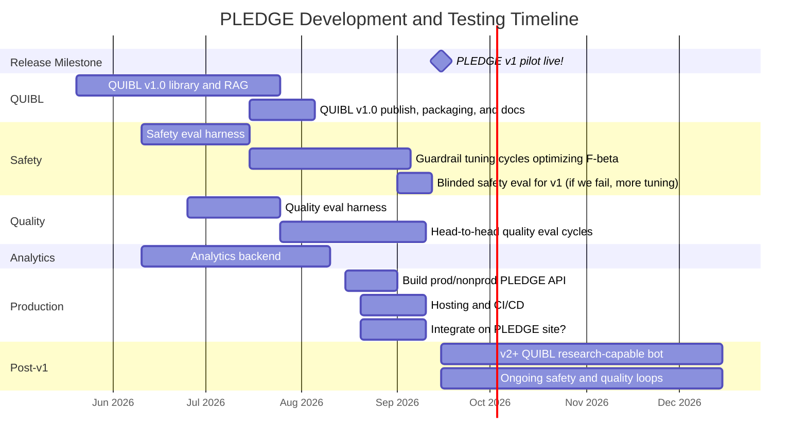

---
tags:
  - Project/PLEDGE
  - Type/Reference
---

# Timeline

This page offers a proposed dev/rollout scheduled for PLEDGE v1 and after. The bars in the gantt chart are guidelines, but it's hard to give a strict prediction about various parts of the process. See [[Eval and Testing General]], [[PLEDGE Safety Iteration]], and [[PLEDGE Quality Iteration]] for details.

## v1 release target

I set **2026-09-15** as the hopeful target for release of a first usable pilot: a live hosted [[PLEDGE API]] backed by a **v1** QUIBL config implementing primitive retrieval on a fixed reference corpus, with basic chunking/RAG and guardrails that have passed the safety loop. 

Response quality for v1 is whatever the leading config earns in pairwise eval before freeze, but will naturally be constrained by the above. v2 and later (larger corpus, richer retrieval, tool access) will be under ongoing development after the v1 release, always passing through the same quality and safety eval loops (pending changes we decide on based on what we learn from v1 rollout)

### Notes:

Within 'Guardrail tuning cycles' there is a lot going on. Would be good to get to this point ASAP.